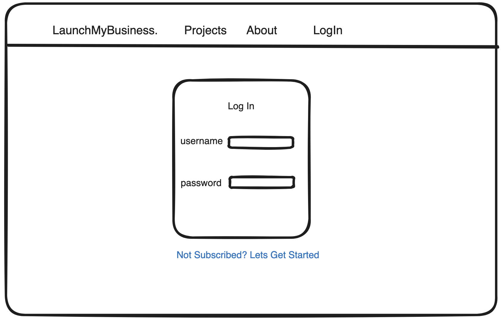
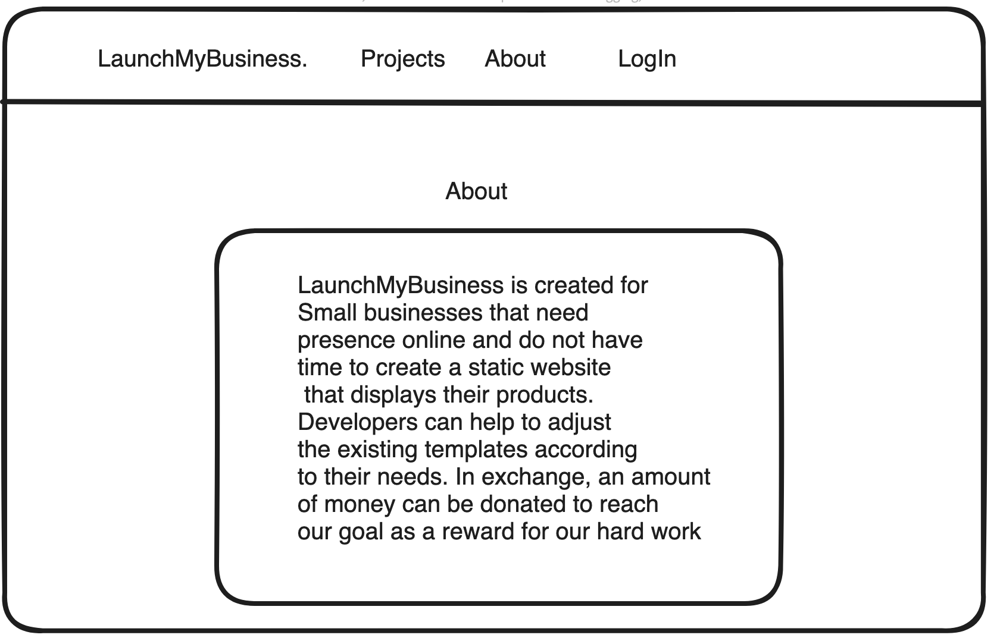
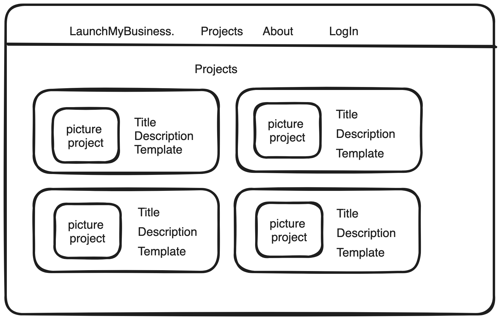
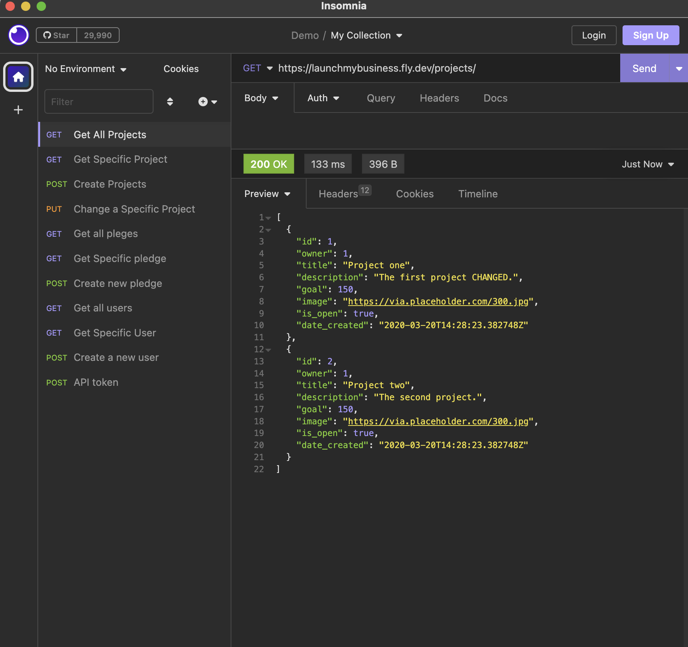
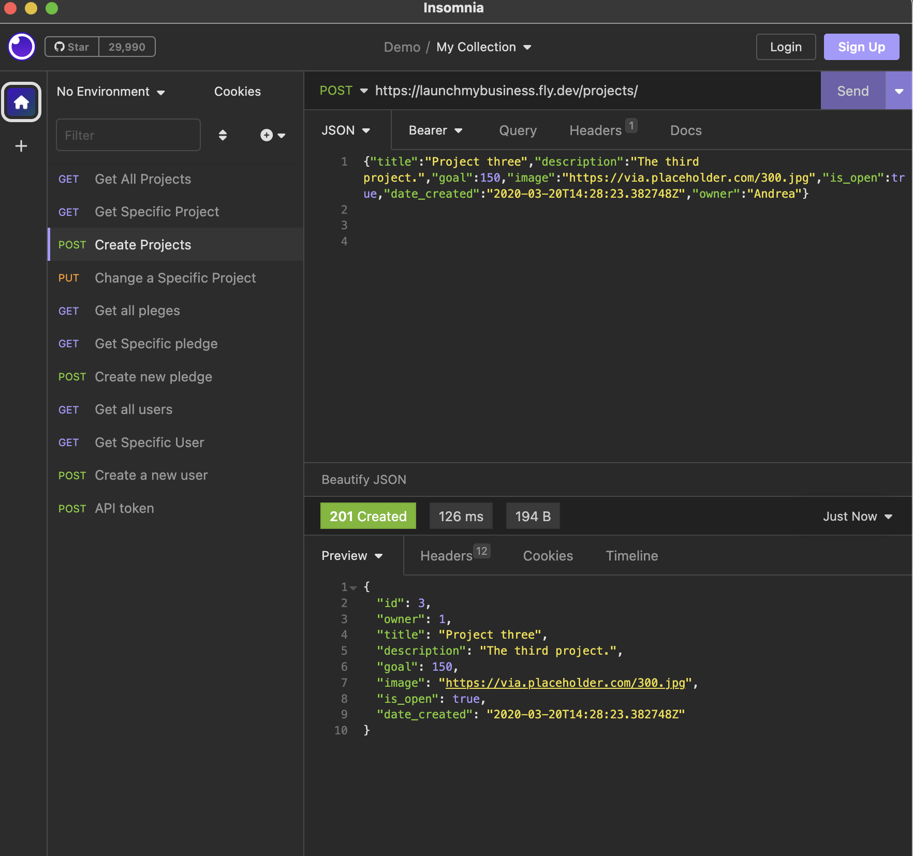
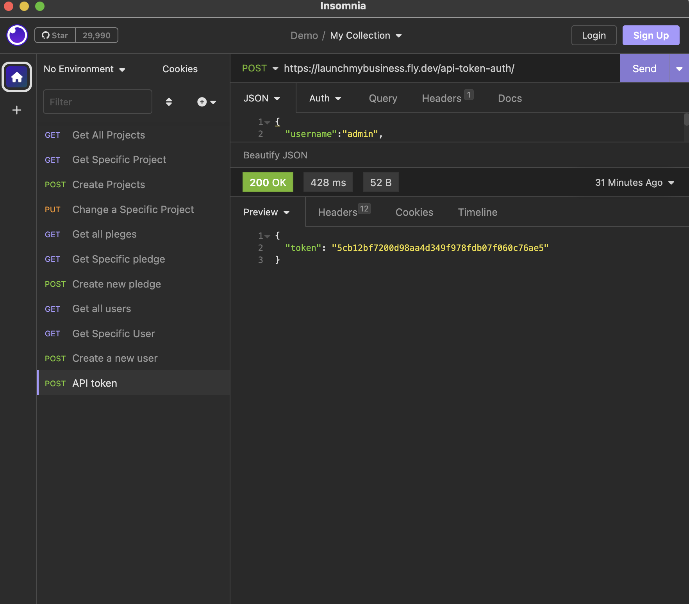
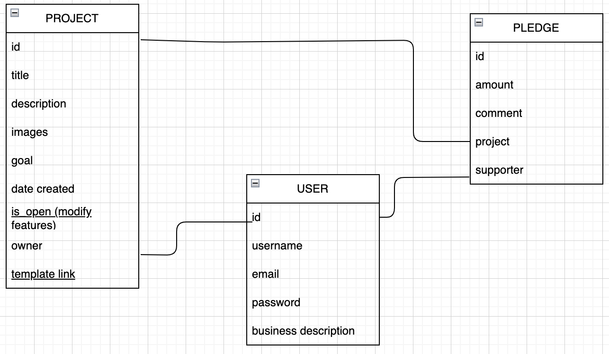

# LaunchMyBusiness by Andrea Rivera
[My crowdfunding App]( https://launchmybusiness.fly.dev)
* She Codes crowdfunding project - DRF Backend.

## About
LaunchMyBusiness is created for Small businesses that need presence online and do not have time to create a static website that displays their products. 
Developers can help to adjust the existing templates according to their needs. In exchange, an amount 
of money can be donated to reach our goal as an incentive to keep enhancing our skills as developers at the same time that  small businesses grow.

## Features

* [x] A user can login and see the template projects
* [x] The owner(user) can create a project
* [x] The supporter can pledge to a project.
* [x] Users can make comments to the projects to improve its functionality.
* [x] Users can contribute with an amount of money to the goal of each project
* [x] Each project will have a description with the template that each user will need to set up their own website for their business 
* [x] Each project will the images provided by the user that will be adapted to the template.

### Stretch Goals

* [] Online Payments
* [] Users can see the projects by categories
* [] Users can send messages to the developer of the templates.

## Wireframes

## Colour Scheme
* Colors: #264653, #2a9d8f,#e9c46a,#f4a261,#e76f51 
* Link: (https://coolors.co/palettes/trending)

## Fonts
* Header Fonts: font-family: 'Tektur', cursive;
* Body Fonts: font-family: 'Roboto', sans-serif;

## Submission Documentation

Deployed Project: [Deployed website](https://launchmybusiness.fly.dev)

### How To Run
1. Clone the repo to your local machine
2. In the terminal, change directory into the repo you cloned using the command `cd crowdfounding` .
3. Set up a virtual environment using the command `python -m venv venv`.
4. Activate the environment. if you use Windows with the command `venv/Scripts/activate`.  If you are in a Mac `source venv/bin/activate`
6. Open the folder in VS code.
7. Change directories so that you are in the same location as your manage.py file. Use the command `cd crowdfounding` 
8. Migrate the database using the command `python manage.py migrate`
9. Finally, run the server with the following command: `python manage.py runserver`

### Screenshots
[x] A link to the deployed project.
[My crowdfunding App]( https://launchmybusiness.fly.dev)

[x] A screenshot of Insomnia, demonstrating a successful GET method for any endpoint.

[x] A screenshot of Insomnia, demonstrating a successful POST method for anyendpoint.

[x] A screenshot of Insomnia, demonstrating a token being returned.

[x] Step by step instructions for how to register a new user and create a newproject (i.e. endpoints and body data).

### How To Register a New User in insomnia
1. Verify if the user has a token 
2. Go to the API token request and enter the superuser username and password.
3. Generate the token.
4. Go to the endpoint created to POST users: 
(https://launchmybusiness.fly.dev/users/)
5.  Insert the body of the POST request: 
{ 
"username":"superuser2",
"email":"superuser@hotmail.com",
"password":"**********"
}

6. In the tab Auth go to Bearer and introduce the token.

7. Click on the "Send" button

8. A 200 OK code should be returned.

### How To Register a New Project in insomnia

1. Verify if the user has a token 
2. Go to the API token request and enter the superuser username and password.
3. Generate the token.
4. Go to the endpoint created to POST users: 
(https://launchmybusiness.fly.dev/projects/)
5.  Insert the body of the POST request: 

{
    "title":"Project three",
    "description":"The third project.",
    "goal":150,
    "image":"https://via.placeholder.com/300.jpg","is_open":true,
    "date_created":"2020-03-20T14:28:23.382748Z","owner":"Andrea"}

6. In the tab Auth go to Bearer and introduce the token.

7. Click on the "Send" button

8. A 200 OK code should be returned.

[x] Your refined API specification and Database Schema.
## API Specification

| HTTP Method | Url | Purpose | Request Body | Successful Response Code | Authentication|Authorization
  
| GET | projects/ | Return all projects | N/A | 200 | N/A |
  
| POST | projects/ | Create a new project | project object | 201 | User must be logged in or have the token. |
  
| GET | projects/project_ID | Returns the project with project_ID | project object | 201 |  N/A  |
  
| PUT | projects/project_ID | Updates the project with project_ID | project object | 201 |  User must be logged in or have the token AND must be the project owner |
  
  
| GET | pledges/ | Return all pledges | N/A | 200 | N/A |
  
| POST | pledges/ | Create a new pledge | pledge object | 201 | User must be logged in or have the token. |
  
  
| GET | users/ | Return all users | N/A | 200 | N/A |
  
| POST | users/ | Create a new user | user object | 201 | User must be logged in or have the token. |
  

## Database Schema

